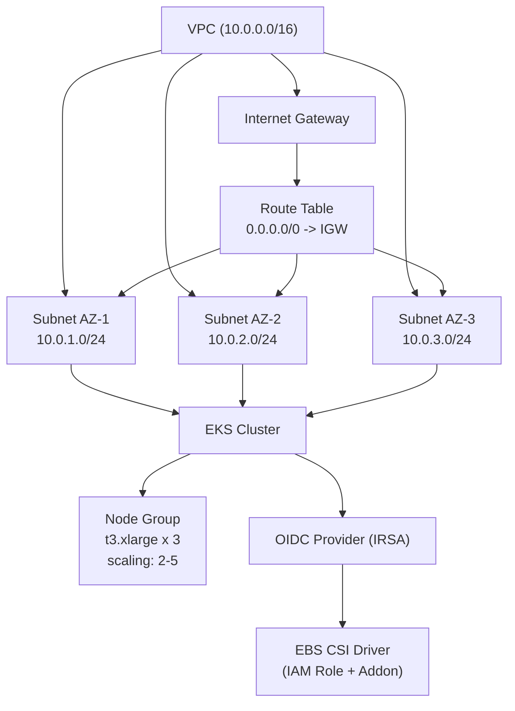
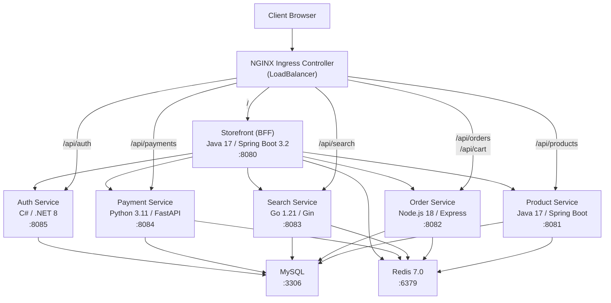

# ZylkerKart - Kubernetes Deployment with Terraform

ZylkerKart is a polyglot microservices e-commerce platform deployed to **AWS EKS** or **Azure AKS** using Terraform. The project provisions cloud infrastructure, deploys six application microservices written in five languages, and optionally integrates Site24x7 for APM and chaos engineering.

**Key features:**

- **Multi-cloud** -- deploy to AWS EKS or Azure AKS with a single variable toggle
- **6 microservices** in Java, Node.js, Go, Python, and C#/.NET
- **NGINX Ingress Controller** with path-based routing to all services
- **MySQL** (persistent) and **Redis** (in-memory cache) backing stores
- **Site24x7 APM** with language-specific agents (optional)
- **Site24x7 Labs chaos engineering** agent with fault injection SDK (optional)

---

## Architecture

### Infrastructure (AWS EKS)



### Application



### Microservices

| Service | Technology | Port | Database | APM Agent |
|---------|-----------|------|----------|-----------|
| **storefront** | Java 17 / Spring Boot 3.2 | 8080 | -- | Java (init container) |
| **product-service** | Java 17 / Spring Boot | 8081 | `db_product` | Java (init container) |
| **order-service** | Node.js 18 / Express | 8082 | `db_order` | Node.js (init container) |
| **search-service** | Go 1.21 / Gin | 8083 | `db_search` | Go (eBPF DaemonSet) |
| **payment-service** | Python 3.11 / FastAPI | 8084 | `db_payment` | Python (init container) |
| **auth-service** | C# / .NET 8 | 8085 | `db_auth` | .NET (init container) |

---

## Prerequisites

### Required Tools

| Tool | Version | Purpose |
|------|---------|---------|
| [Terraform](https://developer.hashicorp.com/terraform/install) | >= 1.5 | Infrastructure provisioning |
| [kubectl](https://kubernetes.io/docs/tasks/tools/) | Latest | Kubernetes cluster management |
| [AWS CLI v2](https://docs.aws.amazon.com/cli/latest/userguide/install-cliv2.html) | Latest | AWS authentication (if deploying to AWS) |
| [Azure CLI](https://learn.microsoft.com/en-us/cli/azure/install-azure-cli) | Latest | Azure authentication (if deploying to Azure) |

### Optional Tools

| Tool | Purpose |
|------|---------|
| [Helm](https://helm.sh/docs/intro/install/) | Debugging Helm releases (Terraform manages Helm directly) |
| [PowerShell](https://learn.microsoft.com/en-us/powershell/scripting/install/installing-powershell) | Required for Site24x7 APM lifecycle scripts |

### Cloud Credentials

**AWS:**
- IAM user or role with permissions for: VPC, Subnets, Internet Gateway, Route Tables, EKS, EC2, IAM Roles/Policies, EBS, STS
- Authenticate via `aws configure` or environment variables (`AWS_ACCESS_KEY_ID`, `AWS_SECRET_ACCESS_KEY`)

**Azure:**
- Subscription with Contributor access
- Authenticate via `az login`

### Site24x7 APM (Optional)

If enabling APM monitoring, export these environment variables before running Terraform:

```bash
export SITE24X7_CLIENT_ID="your-client-id"
export SITE24X7_CLIENT_SECRET="your-client-secret"
export SITE24X7_REFRESH_TOKEN="your-refresh-token"
```

On Windows (PowerShell):

```powershell
$env:SITE24X7_CLIENT_ID = "your-client-id"
$env:SITE24X7_CLIENT_SECRET = "your-client-secret"
$env:SITE24X7_REFRESH_TOKEN = "your-refresh-token"
```

---

## Project Structure

```
.
├── main.tf                          # Terraform settings and provider configurations
├── variables.tf                     # Input variables and computed locals
├── eks.tf                           # AWS: VPC, subnets, EKS cluster, node group, IAM, OIDC, EBS CSI
├── aks.tf                           # Azure: Resource Group and AKS cluster
├── k8s-resources.tf                 # Kubernetes resources: namespaces, deployments, services, ingress
├── site24x7_apm.tf                  # Site24x7 APM agent lifecycle (register, fetch, cleanup)
├── site24x7_chaos_agent.tf          # Site24x7 Labs chaos engineering agent (DaemonSet + setup)
├── outputs.tf                       # Terraform output values
├── terraform.tfvars.example         # Example variable values (copy to terraform.tfvars)
└── scripts/
    ├── wait_for_apm_registration.ps1    # Poll Site24x7 API for APM agent registration
    ├── fetch_and_store_apm.ps1          # Fetch and store APM application data
    ├── delete_apm_monitors.ps1          # Delete APM monitors on terraform destroy
    ├── setup_site24x7_labs_env.ps1      # Set up Site24x7 Labs environment (standalone)
    └── install_site24x7_chaos_agent.ps1 # Multi-platform chaos agent installer
```

---

## Configuration

### Quick Start

1. Copy the example variables file:

   ```bash
   cp terraform.tfvars.example terraform.tfvars
   ```

2. Edit `terraform.tfvars` and set the values for your environment. At minimum, set `cloud_provider`:

   ```hcl
   cloud_provider = "aws"   # or "azure"
   ```

### Cloud Provider Toggle

The `cloud_provider` variable controls which cloud infrastructure is provisioned. All cloud-specific resources use conditional `count` expressions, so only the selected provider's resources are created.

| Value | Infrastructure Created |
|-------|----------------------|
| `"aws"` | VPC, Subnets, IGW, Route Tables, EKS Cluster, Node Group, IAM Roles, OIDC, EBS CSI |
| `"azure"` | Resource Group, AKS Cluster (SystemAssigned identity, Azure CNI) |

### Variables Reference

#### Core

| Variable | Type | Default | Description |
|----------|------|---------|-------------|
| `cloud_provider` | `string` | **Required** | `"aws"` or `"azure"` |
| `cluster_name` | `string` | `"zylkerkart-cluster"` | Name of the Kubernetes cluster |
| `ticket_id` | `string` | `""` | Appended to cluster name and APM app names for unique identification |

#### Cluster

| Variable | Type | Default | Description |
|----------|------|---------|-------------|
| `kubernetes_version` | `string` | `"1.29"` | Kubernetes version (verify cloud provider support) |
| `node_count` | `number` | `3` | Desired number of worker nodes (scaling range: 2-5) |

#### AWS-Specific

| Variable | Type | Default | Description |
|----------|------|---------|-------------|
| `aws_region` | `string` | `"us-east-1"` | AWS region |
| `aws_vpc_cidr` | `string` | `"10.0.0.0/16"` | VPC CIDR block |
| `aws_subnet_cidrs` | `list(string)` | `["10.0.1.0/24", "10.0.2.0/24", "10.0.3.0/24"]` | Subnet CIDRs (minimum 2 AZs required) |

#### Azure-Specific

| Variable | Type | Default | Description |
|----------|------|---------|-------------|
| `azure_resource_group_name` | `string` | `"rg-zylkerkart"` | Azure Resource Group name |
| `azure_location` | `string` | `"eastus"` | Azure region |

#### Application

| Variable | Type | Default | Sensitive | Description |
|----------|------|---------|-----------|-------------|
| `docker_registry` | `string` | `"zylkerkart"` | No | Docker registry prefix for application images |
| `image_tag` | `string` | `"latest"` | No | Docker image tag for all microservices |
| `mysql_root_password` | `string` | `"ZylkerKart@2024"` | **Yes** | MySQL root password |
| `jwt_secret` | `string` | *(64-char default)* | **Yes** | JWT signing secret (minimum 32 characters) |

#### Site24x7 APM

| Variable | Type | Default | Sensitive | Description |
|----------|------|---------|-----------|-------------|
| `site24x7_license_key` | `string` | `""` | **Yes** | Site24x7 license key. Leave empty to disable APM. |
| `apm_app_name_prefix` | `string` | `"ZylkerKart-"` | No | Filter prefix for APM monitor management |
| `expected_app_count` | `number` | `6` | No | Number of APM apps expected to register |

#### Site24x7 Chaos Engineering

| Variable | Type | Default | Description |
|----------|------|---------|-------------|
| `site24x7_server` | `string` | `"204.168.155.117"` | Site24x7 Labs server address |
| `site24x7_namespace` | `string` | `"site24x7-labs"` | Kubernetes namespace for chaos agent |
| `site24x7_image` | `string` | `"impazhani/site24x7-labs-agent:v2-chaospage"` | Chaos agent Docker image |
| `site24x7_environment_name` | `string` | `"zylkerkart"` | Environment name in Site24x7 Labs |
| `site24x7_admin_email` | `string` | `"admin@site24x7labs.local"` | Admin email for Site24x7 Labs |
| `site24x7_admin_password` | `string` | `"admin123"` | Admin password for Site24x7 Labs (**sensitive**) |

---

## Deployment

### Step 1: Initialize Terraform

```bash
terraform init
```

This downloads the required providers (AWS, Azure, Kubernetes, Helm, etc.) and initializes the working directory.

### Step 2: Review the Execution Plan

```bash
terraform plan
```

Review the resources that will be created. For an AWS deployment, expect ~50+ resources including VPC networking, EKS cluster, IAM roles, and all Kubernetes workloads.

### Step 3: Apply

```bash
terraform apply
```

Type `yes` to confirm, or use `-auto-approve` to skip confirmation:

```bash
terraform apply -auto-approve
```

> **Note:** The full deployment takes approximately 15-25 minutes. The EKS cluster creation alone takes ~10 minutes.

### Step 4: Configure kubectl

After deployment, configure `kubectl` to connect to the cluster.

**AWS:**

```bash
aws eks update-kubeconfig --region us-east-1 --name zylkerkart-cluster
```

Or use the output directly:

```bash
$(terraform output -raw eks_kubeconfig_command)
```

**Azure:**

```bash
az aks get-credentials --resource-group rg-zylkerkart --name zylkerkart-cluster
```

### Step 5: Verify the Deployment

```bash
# Check nodes are Ready
kubectl get nodes

# Check all application pods are Running
kubectl get pods -n zylkerkart

# Check services
kubectl get svc -n zylkerkart

# Check ingress controller
kubectl get pods -n ingress-nginx
kubectl get svc -n ingress-nginx
```

All pods should show `Running` status with `1/1` (or `2/2` for APM-instrumented pods) in the `READY` column.

---

## Accessing the Application

### Get the External Endpoint

```bash
terraform output storefront_external_ip
```

Or via kubectl:

```bash
kubectl get svc ingress-nginx-controller -n ingress-nginx -o jsonpath='{.status.loadBalancer.ingress[0].hostname}'
```

> **AWS note:** The endpoint is an ELB DNS hostname (e.g., `a1b2c3d4-1234567890.us-east-1.elb.amazonaws.com`), not a static IP. It may take 2-3 minutes after deployment for the ELB to become fully available.

### API Routes

| Path | Backend Service | Port |
|------|----------------|------|
| `/` | storefront | 80 |
| `/api/products` | product-service | 8081 |
| `/api/orders` | order-service | 8082 |
| `/api/cart` | order-service | 8082 |
| `/api/search` | search-service | 8083 |
| `/api/payments` | payment-service | 8084 |
| `/api/auth` | auth-service | 8085 |

Test the application:

```bash
# Storefront
curl http://<EXTERNAL_ENDPOINT>/

# Product API
curl http://<EXTERNAL_ENDPOINT>/api/products

# Search API
curl http://<EXTERNAL_ENDPOINT>/api/search?q=laptop
```

---

## Monitoring & APM (Site24x7)

APM is **disabled by default**. To enable it, set `site24x7_license_key` in your `terraform.tfvars` and export the OAuth environment variables (see [Prerequisites](#site24x7-apm-optional)).

### APM Agents

When APM is enabled, each microservice is instrumented with a language-specific Site24x7 APM agent:

| Service | Agent | Deployment Method | APM Application Name |
|---------|-------|-------------------|---------------------|
| storefront | Java Agent | Init container (`site24x7/apminsight-javaagent`) | `ZylkerKart-Storefront` |
| product-service | Java Agent | Init container (`site24x7/apminsight-javaagent`) | `ZylkerKart-ProductService` |
| order-service | Node.js Agent | Init container (`site24x7/apminsight-nodejsagent`) | `ZylkerKart-OrderService` |
| search-service | Go Agent | DaemonSet exporter (eBPF-based) | `ZylkerKart-SearchService` |
| payment-service | Python Agent | Init container (`site24x7/apminsight-pythonagent`) | `ZylkerKart-PaymentService` |
| auth-service | .NET Agent | Init container (`site24x7/apminsight-dotnetagent`) | `ZylkerKart-AuthService` |

### Server Monitoring

When APM is enabled, the following monitoring components are also deployed:

- **Site24x7 Server Agent** -- DaemonSet in `default` namespace (`site24x7/docker-agent:release22000`) for host-level metrics
- **Kube State Metrics** -- Deployment in `default` namespace (`kube-state-metrics:v2.9.2`) for cluster state metrics

### APM Outputs

```bash
# View managed APM applications
terraform output -json managed_applications

# View application performance summary (response time, apdex, throughput, errors)
terraform output -json application_summary

# View all monitored instances
terraform output -json all_instances
```

---

## Chaos Engineering (Site24x7 Labs)

The Site24x7 Labs chaos engineering agent is deployed as a DaemonSet in the `site24x7-labs` namespace. It enables fault injection experiments (latency, errors, resource stress) on the running microservices.

### How It Works

1. During `terraform apply`, a provisioner authenticates to the Site24x7 Labs API, creates an environment, and obtains an agent token
2. The chaos agent DaemonSet is deployed with the token, running privileged with access to host PID namespace and cgroup filesystem
3. All six application pods have `CHAOS_SDK_ENABLED=true` set and mount a shared fault configuration directory (`/var/site24x7-labs/faults`) via a hostPath volume
4. Chaos experiments initiated through Site24x7 Labs write fault configurations to the shared volume, which the application chaos SDKs read and apply

### Configuration

The chaos agent is configured via the `site24x7_*` variables (see [Variables Reference](#site24x7-chaos-engineering)). The key settings are:

- `site24x7_server` -- Labs server address
- `site24x7_environment_name` -- environment grouping for the cluster
- `site24x7_admin_email` / `site24x7_admin_password` -- Labs API credentials

---

## Destroy / Cleanup

To tear down all resources:

```bash
terraform destroy
```

### Destroy Behavior

The destroy process includes automated cleanup steps:

1. **ELB Cleanup** -- A `null_resource` runs `kubectl delete` on LoadBalancer services (storefront and ingress-nginx-controller) and waits 90 seconds for AWS to fully deprovision the Elastic Load Balancers before VPC resources are destroyed. This prevents the common "IGW still has dependencies" error.

2. **APM Monitor Cleanup** -- If APM was enabled, the `delete_apm_monitors.ps1` script runs to delete all managed APM monitors from Site24x7 via the API.

> **Tip:** If destroy gets stuck on VPC/IGW deletion, manually check for lingering ELBs or ENIs in the AWS Console under **EC2 > Load Balancers** and **EC2 > Network Interfaces**.

---

## Troubleshooting

### `helm_release.ingress_nginx` Stuck Creating

**Symptom:** `terraform apply` shows `helm_release.ingress_nginx: Still creating...` for over 10 minutes.

**Cause:** The Helm provider's `wait = true` (default) polls until all chart resources are fully ready. The ingress-nginx admission webhook can cause the wait loop to hang even though the deployment is functional.

**Fix:** Add `wait = false` to the `helm_release.ingress_nginx` resource in `k8s-resources.tf`:

```hcl
resource "helm_release" "ingress_nginx" {
  # ...existing config...
  wait = false
}
```

**Verify the release is actually healthy:**

```bash
kubectl get pods -n ingress-nginx
kubectl get svc -n ingress-nginx
```

If pods are `Running` and the LoadBalancer has an external IP/hostname, the release is working correctly.

### Terraform Dependency Cycle Error

**Symptom:** `Error: Cycle: kubernetes_service.storefront, aws_route_table.eks, ...`

**Cause:** Circular `depends_on` between `null_resource.wait_for_elb_cleanup`, `aws_internet_gateway.eks`, and Kubernetes resources. This happens when the IGW has a `depends_on` pointing to the null_resource, which itself depends on Kubernetes resources that need the EKS cluster (which needs the IGW).

**Fix:** Remove `depends_on = [null_resource.wait_for_elb_cleanup]` from `aws_internet_gateway.eks` in `eks.tf`, and remove the `depends_on` block from `null_resource.wait_for_elb_cleanup` in `k8s-resources.tf`. The destroy provisioner uses `kubectl` CLI commands directly and does not need Terraform-level dependency edges.

### Pods Stuck in Pending

```bash
# Check node capacity and resource pressure
kubectl describe nodes | grep -A 5 "Conditions"

# Check pod events for scheduling failures
kubectl describe pod <pod-name> -n zylkerkart
```

Common causes:
- **Insufficient node capacity** -- increase `node_count` or use a larger instance type
- **EBS CSI driver not ready** -- check `kubectl get pods -n kube-system -l app.kubernetes.io/name=aws-ebs-csi-driver`
- **PVC pending** -- check `kubectl get pvc -n zylkerkart` and verify the storage class exists

### LoadBalancer Service Stuck in Pending

```bash
kubectl describe svc ingress-nginx-controller -n ingress-nginx
```

Common causes:
- Internet Gateway or route table not yet created
- Subnet tags missing (`kubernetes.io/role/elb = 1`)
- AWS account ELB/EIP quota reached

### IGW Deletion Fails on Destroy

**Symptom:** `Error deleting Internet Gateway: DependencyViolation`

**Cause:** ELBs or ENIs are still attached to the VPC subnets.

**Fix:**
1. Delete LoadBalancer services manually: `kubectl delete svc --all -n ingress-nginx && kubectl delete svc storefront -n zylkerkart`
2. Wait 2-3 minutes for AWS to deprovision the ELBs
3. Re-run `terraform destroy`

### kubectl Cannot Connect to Cluster

```bash
# Verify kubeconfig is current
aws eks update-kubeconfig --region us-east-1 --name zylkerkart-cluster

# Test connectivity
kubectl cluster-info

# Check EKS endpoint access
aws eks describe-cluster --name zylkerkart-cluster --query "cluster.resourcesVpcConfig.endpointPublicAccess"
```

### Diagnostic Commands

```bash
# View events (sorted by time) in a namespace
kubectl get events -n zylkerkart --sort-by='.lastTimestamp'

# View pod logs
kubectl logs <pod-name> -n zylkerkart

# View logs for a specific container in a multi-container pod
kubectl logs <pod-name> -n zylkerkart -c <container-name>

# Check resource usage
kubectl top nodes
kubectl top pods -n zylkerkart

# View all resources in the zylkerkart namespace
kubectl get all -n zylkerkart
```

---

## Outputs Reference

| Output | Sensitive | Description |
|--------|-----------|-------------|
| `cloud_provider` | No | Active cloud provider (`aws` or `azure`) |
| `cluster_name` | No | Kubernetes cluster name |
| `eks_cluster_endpoint` | No | EKS cluster API endpoint |
| `eks_cluster_ca_certificate` | Yes | EKS cluster CA certificate (base64) |
| `eks_kubeconfig_command` | No | Command to configure kubectl for EKS |
| `aks_kube_config` | Yes | Raw kubeconfig for AKS |
| `aks_cluster_fqdn` | No | AKS cluster FQDN |
| `storefront_external_ip` | No | External IP or hostname of the storefront LoadBalancer |
| `apm_enabled` | Yes | Whether APM monitoring is active |
| `filter_prefix` | Yes | APM application name filter prefix |
| `managed_applications` | Yes | Map of managed APM application IDs to names |
| `skipped_applications` | Yes | Map of APM applications not matching the filter |
| `application_summary` | Yes | Per-application metrics (response time, apdex, throughput, errors) |
| `all_instances` | Yes | Flattened list of all APM-monitored instances |
| `total_managed_apps` | Yes | Count of managed APM applications |
| `total_managed_instances` | Yes | Count of total managed APM instances |
| `total_skipped_apps` | Yes | Count of skipped APM applications |
| `site24x7_chaos_agent_status` | No | Chaos agent deployment summary |
| `site24x7_agent_token` | Yes | Chaos agent authentication token |

View all outputs:

```bash
terraform output
```

View sensitive outputs:

```bash
terraform output -json
```

---

## Notes & Caveats

- **Local state backend** -- Terraform state is stored locally in `terraform.tfstate`. For team environments, configure a remote backend such as [S3 + DynamoDB](https://developer.hashicorp.com/terraform/language/backend/s3) (AWS) or [Azure Blob Storage](https://developer.hashicorp.com/terraform/language/backend/azurerm) for state locking and shared access.

- **Sensitive defaults** -- Variables like `mysql_root_password` and `jwt_secret` have default values intended for development. Change these for any non-local deployment.

- **Kubernetes version** -- Verify that the `kubernetes_version` you set is [supported by EKS](https://docs.aws.amazon.com/eks/latest/userguide/kubernetes-versions.html) or [supported by AKS](https://learn.microsoft.com/en-us/azure/aks/supported-kubernetes-versions) before deploying.

- **Node sizing** -- Default instance types are `t3.xlarge` (AWS) and `Standard_D4s_v3` (Azure), providing 4 vCPU / 16 GB RAM per node. Adjust based on workload requirements by modifying the `node_size` local in `variables.tf`.

- **EBS CSI driver** -- Required on AWS for MySQL persistent storage. The driver is deployed automatically via `aws_eks_addon` with IRSA (IAM Roles for Service Accounts) for secure access.
